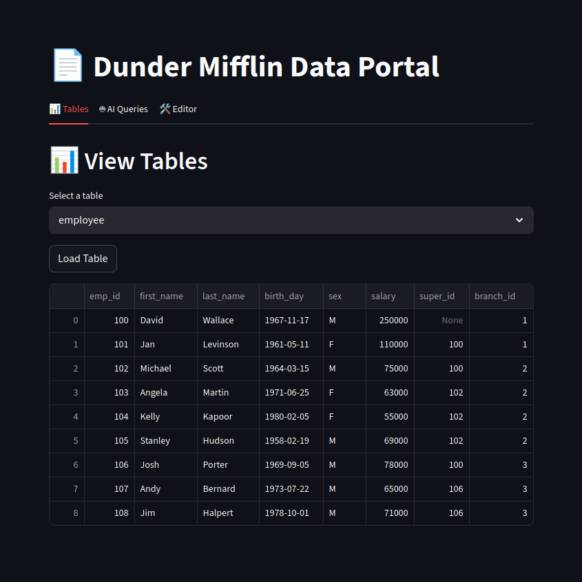
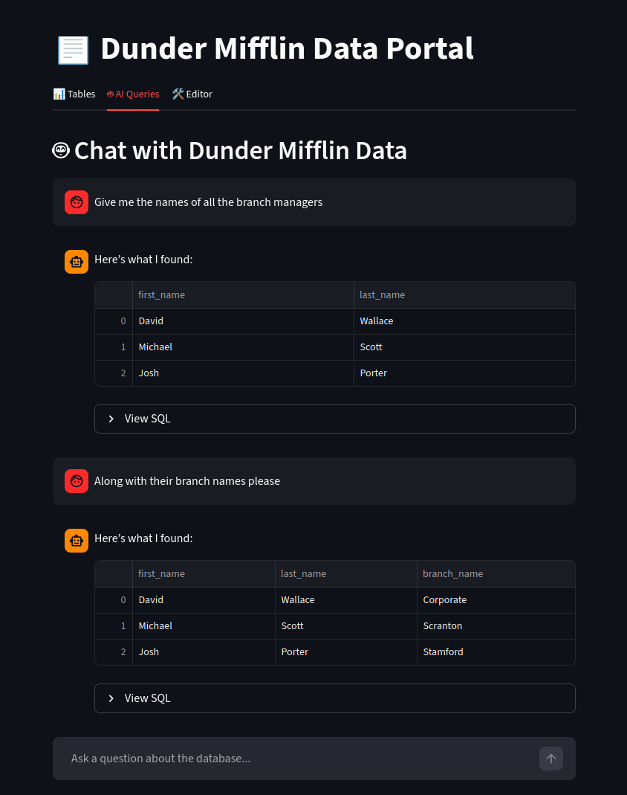
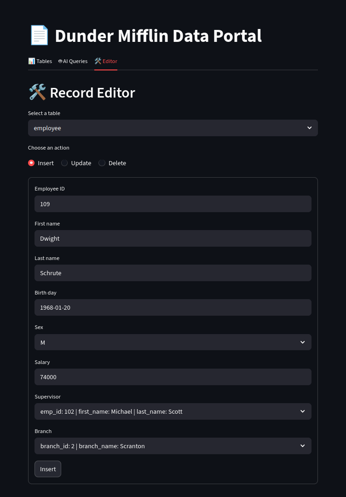

# Dunder Mifflin Portal

A small Streamlit app for exploring and editing a PostgreSQL version of the Dunder Mifflin company database.

The project combines:
- A table viewer for browsing data
- An AI query tab that turns natural-language questions into SQL
- A record editor for inserting, updating, and deleting rows through forms

## What This Project Does

This app helps users interact with a sample company database without writing SQL for every task.

The Streamlit interface currently includes:
- `Tables`: view records from the main database tables
- `AI Queries`: ask questions in natural language and let the app generate `SELECT` queries
- `Editor`: insert, update, or delete records with table-aware forms and foreign-key dropdowns

Under the hood:
- Streamlit provides the UI
- PostgreSQL stores the Dunder Mifflin data
- SQLAlchemy handles database connections and parameterized SQL execution
- Pandas is used for reading query results into dataframes
- Groq is used to convert user questions into SQL and to repair invalid generated queries when needed

## Project Structure

- [app.py](/home/derrylkevinmonis/Personal/dunder-mifflin-portal/app.py): entry point for the Streamlit app
- [ui/components.py](/home/derrylkevinmonis/Personal/dunder-mifflin-portal/ui/components.py): UI for the tables, AI chat, and editor tabs
- [core/db.py](/home/derrylkevinmonis/Personal/dunder-mifflin-portal/core/db.py): PostgreSQL connection and database read/write helpers
- [core/llm.py](/home/derrylkevinmonis/Personal/dunder-mifflin-portal/core/llm.py): AI-powered SQL generation and retry logic
- [core/config.py](/home/derrylkevinmonis/Personal/dunder-mifflin-portal/core/config.py): loads local config from `credentials.ini`
- [db_tutorials](/home/derrylkevinmonis/Personal/dunder-mifflin-portal/db_tutorials): schema, ER diagrams, relationship references, and SQL files used to set up and explore the database
- [screenshots](/home/derrylkevinmonis/Personal/dunder-mifflin-portal/screenshots): demo screenshots of the Streamlit app

## Database Tutorials And Setup Resources

The [db_tutorials](/home/derrylkevinmonis/Personal/dunder-mifflin-portal/db_tutorials) folder contains the supporting database material for this project, including:
- `create_company_database.sql` for creating tables and loading the initial PostgreSQL data
- ER and relationship diagrams such as `company-erd.png` and `company-relations.png`
- Additional SQL practice/reference files such as joins, functions, wildcards, nested queries, triggers, and unions
- `company-database.pdf` for reference material around the database

If you want to recreate the database locally, this folder is the main place to start.

## Brief Setup

1. Create a Python environment and install the packages used by the app:
   `streamlit`, `pandas`, `sqlalchemy`, `psycopg2`, and `groq`
2. Create a PostgreSQL database and run the SQL in `db_tutorials/create_company_database.sql`
3. Add a local `credentials.ini` file with the sections expected by the code:
   `dunder_mifflin_db` and `groq_api`
4. Start the app:

```bash
streamlit run app.py
```

The app reads PostgreSQL connection values from `credentials.ini`, connects through SQLAlchemy, and uses the Groq API key from the same file for the AI query feature.

## Demo Screenshots

### Tables Tab



### AI Chat Tab



### Editor Tab


